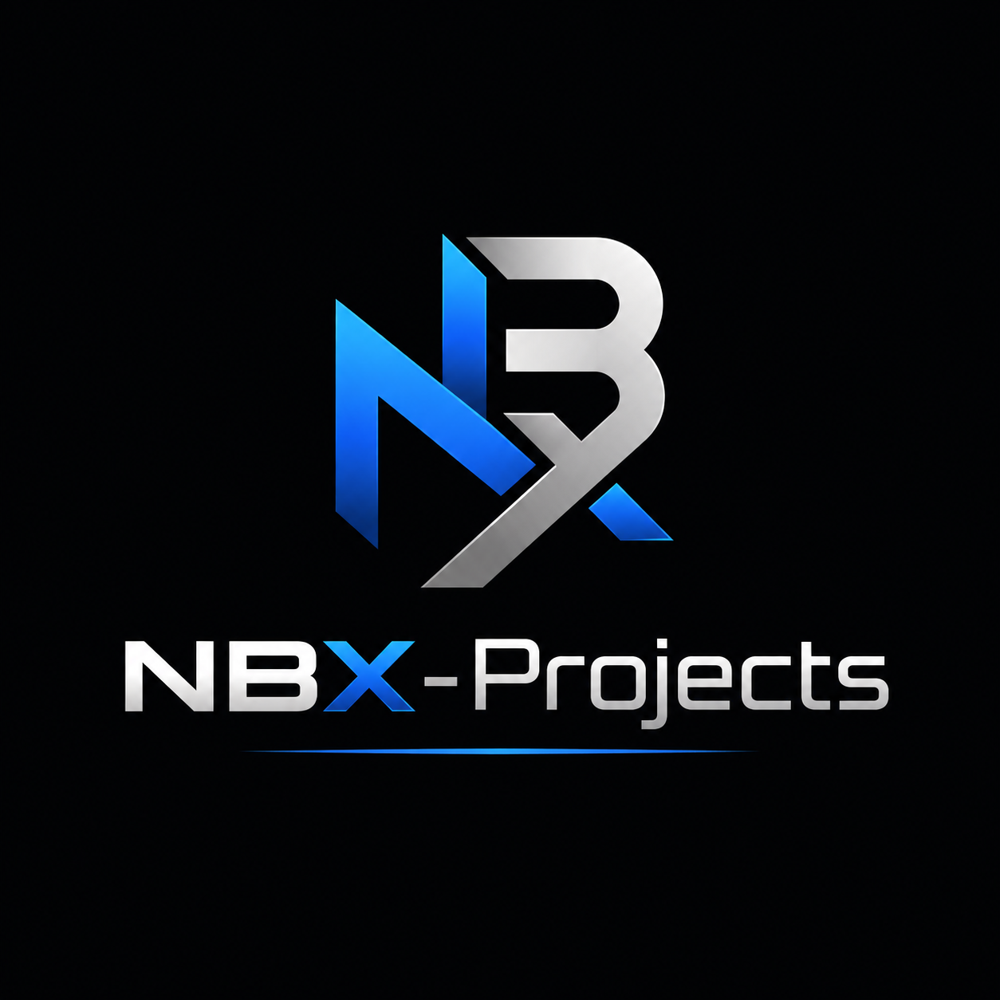

# 🚀 ProjectNBX

<div align="center">
  
  <h3>Plataforma de Comunicação e Voz Cross-Platform para Desenvolvedores e Gamers</h3>
  <p>Uma alternativa moderna, self-hosted e ultra leve ao Discord, construída em <b>Flutter</b> com <b>LiveKit (WebRTC SFU)</b>.</p>
</div>

---

## 📖 Documentação & Guias

- 🚀 **[Guia Passo a Passo de Inicialização (GETTING_STARTED.md)](GETTING_STARTED.md)**
- 🤖 **[Diretrizes de Arquitetura para Agentes & Devs (AGENTS.md)](AGENTS.md)**

---
## 🎨 Design & Protótipo

* 📱 [Acessar Protótipo no Figma (UX-NBX)](https://www.figma.com/make/ZFTQctJ9RrvmF2cPd2BINo/UX-NBX?t=jGh4g2lVq1tvnQ5E-1)

---

## 📌 Visão Geral

O **ProjectNBX** é um aplicativo multiplataforma projetado para grupos e comunidades que buscam alta performance, controle dos próprios dados e latência ultrabaixa em chamadas de voz e compartilhamento de tela.

### 🌟 Destaques
- **Multiplataforma Unificado:** Uma única base de código Flutter rodando em **Windows**, **Linux**, **macOS**, **Android**, **iOS** e **Web**.
- **Áudio de Alta Fidelidade & Baixa Latência:** Alimentado por **LiveKit SFU (WebRTC)** com suporte a DTX (Discontinuous Transmission), cancelamento de ruído e eco.
- **Push-to-Talk Global no Desktop:** Atalhos de teclado que funcionam mesmo com jogos em tela cheia (`hotkey_manager`).
- **Bandeja do Sistema (*System Tray*):** Continue na chamada sem poluir a barra de tarefas ao fechar a janela principal (`tray_manager`).
- **Background Voice no Mobile:** Chamadas ativas em segundo plano no Android (*Foreground Service*) e iOS (*VoIP/Audio Background Modes*).
- **Compartilhamento de Tela:** Transmissão de janelas ou monitores completos em alta taxa de quadros (30/60 fps).

---

## 🛠️ Versões e Tecnologias

| Tecnologia | Versão Recomendada | Canal / Detalhes |
| :--- | :--- | :--- |
| **Flutter SDK** | `3.41.2` (ou superior) | `stable` |
| **Dart SDK** | `3.11.0` | Incluído no Flutter |

---

## 🚀 Como Executar no Windows

### 1. Obter dependências
```bash
flutter pub get
```

### 2. Executar o App no Windows (Desktop)
```bash
flutter run -d windows
```

> **Dica de Desenvolvimento:** Ao executar no Windows, pressione `r` no terminal para Hot Reload instantâneo ou `R` para Hot Restart.

---

## 📱 Execução em Outras Plataformas

```bash
# macOS
flutter run -d macos

# Linux
flutter run -d linux

# Web (Google Chrome / Edge)
flutter run -d chrome

# Android / iOS (com emulador aberto ou celular plugado)
flutter run
```

---

## 📦 Build e Empacotamento de Produção

```bash
# Gerar executável para Windows (.exe)
flutter build windows --release

# Gerar APK / App Bundle para Android
flutter build apk --release
flutter build appbundle --release

# Gerar build Web
flutter build web --release
```

---

## 📄 Licença

Distribuído sob a licença MIT. Consulte `LICENSE` para mais detalhes.
